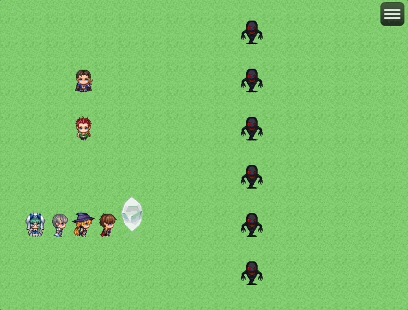

# HTN_AllStatesInMenu

RPGツクールMZ用のプラグインです。

メニュー画面やステータス画面で、通常は４つまでしかステート（状態異常）のアイコンが表示されませんが、  
このプラグインでは数の制限なく全てのステートアイコンを表示できるようになります。  
（※このプラグインは戦闘画面には影響しません）

## 🛠️ 導入方法

**[【ここを右クリックして「名前を付けてリンク先を保存」みたいな項目を選んでダウンロード】](https://raw.githubusercontent.com/nekonenene/RPG-Maker-MZ-plugins/main/my_plugins/HTN_AllStatesInMenu/HTN_AllStatesInMenu.js)**

プラグインの導入方法については、[ツクール公式サイトの講座ページ](https://rpgmakerofficial.com/product/mz/plugin/start/dounyu.html)をご参考に！  
ダウンロードした `HTN_xxx.js` のような名前のファイルを、プロジェクト内の `js/plugins` フォルダーの中に入れてください。

## 🧭 使い方

「プラグイン管理」画面でこのプラグインを追加するだけで機能します。  
設定変更はプラグインの「パラメータ」欄からおこなえます。

### プラグインパラメータ

#### 一度に表示する最大数

一度に表示するステートアイコンの最大数です。  
横幅をこの数で割った均等間隔で、アイコンを左から順に配置します。

見やすいよう、この数に達しないうちは  
できるだけアイコン同士が重ならないように配置されます。

#### すべて表示するか

`true` にすると、「一度に表示する最大数」を超えたぶんのアイコンは、  
設定した秒数ごとに自動で切り替わって表示されます。  

`false` にすると、「一度に表示する最大数」までしか表示されません。  
メニュー画面で切り替わりがあると画面がうるさいと感じる場合にお使いください。

#### 切り替え秒数

「すべて表示するか」を `true` にしたときの、自動切り替わりの秒数です。

## ⚠️ 注意点

このプラグインは、コアスクリプトの `Window_StatusBase.prototype.drawActorIcons` の処理を上書きしているため、  
メニュー画面やステータス画面などをカスタマイズする他のプラグインと競合して、お互いの動作に悪影響を与える可能性があります。  

競合するプラグインがある場合は、  
プラグイン管理画面でお互いのプラグインの並び順（＝呼び出し順）を変えることで解決できる場合もあります。

## 📝 作者情報

ハトネコエ  
**[X : @nekonenene](https://x.com/nekonenene)**  
HP : [https://hato-neko.x0.com](https://hato-neko.x0.com)

バグ報告や要望などは [X](https://x.com/nekonenene) にメンションでお寄せください。

## 📄 ライセンス

MIT License ( https://opensource.org/license/mit )
