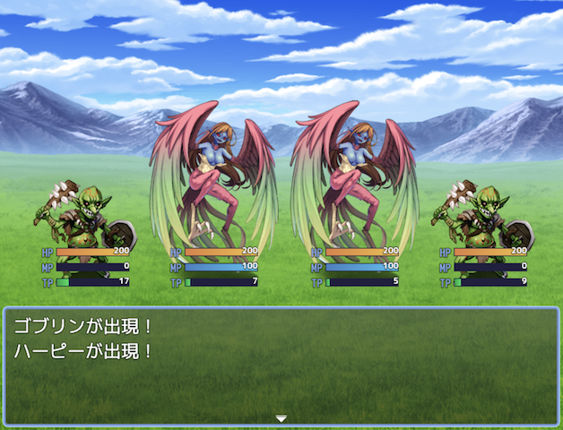

# HTN_DisplayEnemyHpMpTp

RPGツクールMZ用のプラグインです。

戦闘中に敵キャラのHP・MP・TPをゲージ（バー）で表示できるようになります。  
戦闘のデバッグ時に便利です。



## 🛠️ 導入方法

**[【ここを右クリックして「名前を付けてリンク先を保存」みたいな項目を選んでダウンロード】](https://raw.githubusercontent.com/nekonenene/RPG-Maker-MZ-plugins/main/my_plugins/HTN_DisplayEnemyHpMpTp/HTN_DisplayEnemyHpMpTp.js)**

プラグインの導入方法については、[ツクール公式サイトの講座ページ](https://rpgmakerofficial.com/product/mz/plugin/start/dounyu.html)をご参考に！  
ダウンロードした `HTN_xxx.js` のような名前のファイルを、プロジェクト内の `js/plugins` フォルダーの中に入れてください。

## 🧭 使い方

「プラグイン管理」画面でこのプラグインを追加するだけで機能します。  
設定変更はプラグインの「パラメータ」欄からおこなえます。

### プラグインパラメータ

| パラメータ | 説明 |
|---|---|
| HPゲージを表示 | HPゲージの表示・非表示 |
| MPゲージを表示 | MPゲージの表示・非表示 |
| TPゲージを表示 | TPゲージの表示・非表示 |
| 数値を表示 | HP・MP・TP の数値の表示・非表示 |
| 数値のフォントサイズ | ゲージ上の数値のフォントサイズ (px) |
| ラベルを表示 | ゲージに「HP」などのラベルを表示するか |
| ラベルのフォントサイズ | ラベルのフォントサイズ (px) |
| ゲージの表示位置 | 敵画像の下 or 上 |
| ゲージの横幅 | ゲージの横幅 (px) |
| ゲージの高さ | ゲージの高さ (px) |
| ゲージ間の余白 | ゲージ同士の縦方向の余白 (px) |
| X位置調整 | ゲージのX座標を調整（負の値で左、正の値で右へ） |
| Y位置調整 | ゲージのY座標を調整（負の値で上、正の値で下へ） |

## 🧩 機能詳細

- 敵が死亡するとゲージは非表示になります

### タグ一覧

敵キャラの「メモ」欄に記述できるタグの一覧です。  
プラグインパラメータの設定を上書きしない場合には記述しなくて大丈夫です。

- `<DisplayEnemyHpMpTp_Hide>`  
  ゲージを非表示にする
- `<DisplayEnemyHpMpTp_ShowValue: true/false>`  
  数値の表示・非表示を上書き
- `<DisplayEnemyHpMpTp_GaugePosition: bottom/top>`  
  ゲージの表示位置を上書き（`bottom` で敵画像の下、`top` で上）
- `<DisplayEnemyHpMpTp_GaugeWidth: 数値>`  
  各ゲージの横幅 (px) を上書き
- `<DisplayEnemyHpMpTp_GaugeOffsetX: 数値>`  
  ゲージのX座標を調整（負の値で左、正の値で右へ）
- `<DisplayEnemyHpMpTp_GaugeOffsetY: 数値>`  
  ゲージのY座標を調整（負の値で上、正の値で下へ）

#### コピーしやすい用の一覧

```
<DisplayEnemyHpMpTp_Hide>
<DisplayEnemyHpMpTp_ShowValue: false>
<DisplayEnemyHpMpTp_GaugePosition: bottom>
<DisplayEnemyHpMpTp_GaugeWidth: 128>
<DisplayEnemyHpMpTp_GaugeOffsetX: 0>
<DisplayEnemyHpMpTp_GaugeOffsetY: 0>
```

## 📝 作者情報

ハトネコエ  
**[X : @nekonenene](https://x.com/nekonenene)**  
HP : [https://hato-neko.x0.com](https://hato-neko.x0.com)

バグ報告や要望などは [X](https://x.com/nekonenene) にメンションでお寄せください。

## 📄 ライセンス

MIT License ( https://opensource.org/license/mit )
