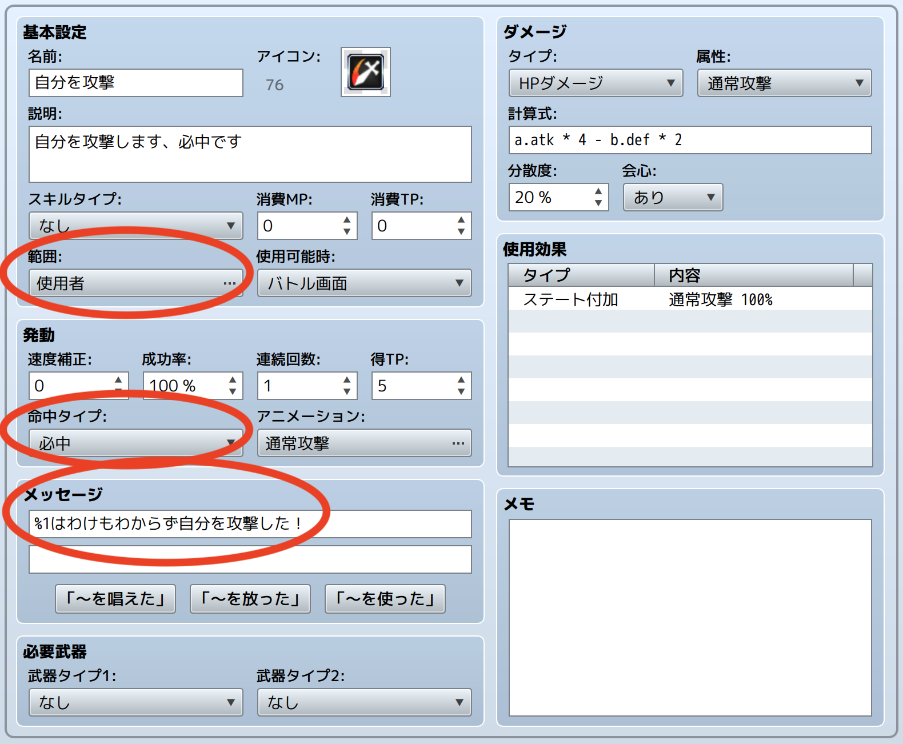
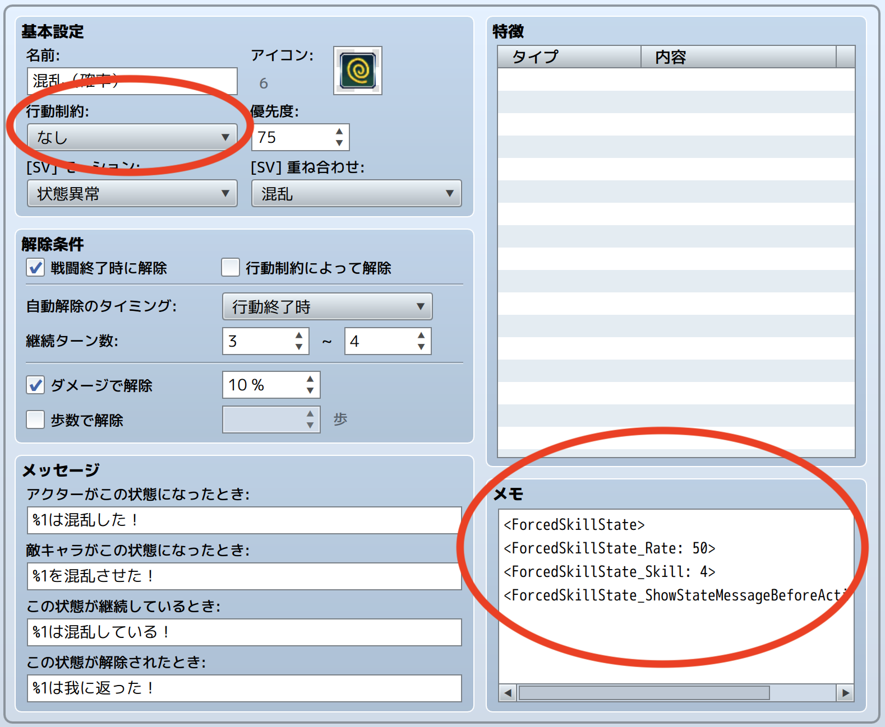

# HTN_ForcedSkillState

RPGツクールMZ用のプラグインです。

一定確率で、指定したスキルを勝手に使ってしまうステート（状態異常）を作成できるようになります。  

自傷・自爆系のスキルを呼び出すことを想定していて、  
例えば「範囲：使用者」の攻撃スキルを50%の確率で使用するステートを作成することで、  
ポケモンの状態異常「こんらん（混乱）」の再現が可能です。

設定例：

| スキル（「攻撃」をコピーして「範囲」など変更） | ステート（「混乱」をコピーして「行動制約」など変更） |
|:---:|:---:|
|  |  |

## 🛠️ 導入方法

**[【ここを右クリックして「名前を付けてリンク先を保存」みたいな項目を選んでダウンロード】](https://raw.githubusercontent.com/nekonenene/RPG-Maker-MZ-plugins/main/my_plugins/HTN_ForcedSkillState/HTN_ForcedSkillState.js)**

プラグインの導入方法については、[ツクール公式サイトの講座ページ](https://rpgmakerofficial.com/product/mz/plugin/start/dounyu.html)をご参考に！  
ダウンロードした `HTN_xxx.js` のような名前のファイルを、プロジェクト内の `js/plugins` フォルダーの中に入れてください。

## 🧭 使い方

「プラグイン管理」画面でこのプラグインを追加した後、  
ステートの「メモ」欄に `<ForcedSkillState>` というタグを記入することで、  
そのステートがこのプラグインの効果を持つようになります。

設定例：

```
<ForcedSkillState>
<ForcedSkillState_Rate: 50>
<ForcedSkillState_Skill: 2>
```

この例の場合、このステートが付与されたキャラクターは、  
50%の確率でスキルID: 2（通常は防御）のスキルを勝手に使います。

特に意図がなければ、ステートの「行動制約」は「なし」に設定します。

## 🧩 機能詳細

### タグ一覧

ステートの「メモ」欄に記述できるタグの一覧です。  

`ForcedSkillState_Rate`, `ForcedSkillState_ShowStateMessageBeforeAction` に関しては、  
プラグインパラメータで設定した値を上書きしない場合には記述しなくても大丈夫です。

- `<ForcedSkillState>`  
  このプラグインを有効化するために必要なタグ
- `<ForcedSkillState_Rate: 10>`  
  指定スキルを勝手に使う確率 (%)
- `<ForcedSkillState_Skill: 2,2,7,9>`  
  スキルIDを指定。カンマ `,` 区切りで複数指定も可能。存在するスキルIDだけが候補になります
- `<ForcedSkillState_SkillName: 防御>`  
  スキル名を指定。カンマ `,` 区切りで複数指定も可能。Skill に有効な候補がない場合のみ参照されます
- `<ForcedSkillState_ShowStateMessageBeforeAction: true/false>`  
  ステートの継続メッセージを行動前に表示するか。false の場合、ツクールMZの本来の挙動通り、行動後に表示されます

#### コピーしやすい用の一覧

```
<ForcedSkillState>
<ForcedSkillState_Rate: 50>
<ForcedSkillState_Skill: 2>
<ForcedSkillState_SkillName: 防御>
<ForcedSkillState_ShowStateMessageBeforeAction: true>
```

### スキル決定の挙動

1. `ForcedSkillState_ShowStateMessageBeforeAction` が true のとき、ステートの継続メッセージが表示される。その後の確率判定の結果などに関わらず表示
2. `ForcedSkillState_Rate` の確率で、スキルを強制使用するかの判定をおこない、強制使用なら次のステップへ
3. `ForcedSkillState_Skill` に書かれたスキルIDのうち、`-1` など存在しないスキルIDを除いたものから１つを選ぶ
4. `ForcedSkillState_Skill` に有効な候補がない場合、 `ForcedSkillState_SkillName` に書かれたスキル名のうち、存在するものから１つを選ぶ
5. `ForcedSkillState_SkillName` にも有効な候補がない場合、元の行動がそのままおこなわれる
6. 有効なスキルがあった場合は、それの使用が強制される。MPやTPの不足、スキル封印、スキルを覚えているかなどの通常の使用条件は無視され、また、別のステートによって混乱状態であっても、スキルの範囲はスキル本来のものが反映される

`<ForcedSkillState>` が設定されたステートが複数用意されていて、  
それらのステートに同時にかかっている場合は、  
ステートの継続メッセージが全て表示されたあと、「優先度」の高いステートから順に判定されます。  
最初に決定された上書きスキルが使用されます。

### 継続メッセージの表示タイミングについて

RPGツクールMZの仕様では、ステートの継続メッセージに関して、  
継続メッセージが設定されているステートのうち、「優先度」がもっとも高い１つのみが表示されます。  
（参考: `Game_BattlerBase.prototype.mostImportantStateText` ）

そのため、プラグインパラメータの「行動前に継続メッセージを表示」を false に設定することや  
メモ欄に `<ForcedSkillState_ShowStateMessageBeforeAction: false>` と記述することをおこなっても、  
必ずしも継続メッセージが行動後に表示されるわけではないことにご注意ください。

## ⚠️ 注意点

### スキル名に `<` や `>` や `,` が含まれる場合

例えば「つよいこうげき(>_<)」という名前のスキルがある場合、  
`<ForcedSkillState_SkillName: つよいこうげき(>_<)>` と記述すると、  
手前の `>` でタグが終わりと認識されてしまい、正しくスキル名が取得されません。

以下の変換表を参考に、`<` や `>` や `,` の文字は置き換えて記述してください。

| 文字 | 置き換え |
|---|---|
| `<` | `&lt;` |
| `>` | `&gt;` |
| `,` | `&comma;` |

例で示した「つよいこうげき(>_<)」の場合、  
`<ForcedSkillState_SkillName: つよいこうげき(&gt;_&lt;)>` と記述します。

### HTN_StunRate との併用

一定確率で行動できないステート（状態異常）を作成できるプラグイン「[HTN_StunRate](https://github.com/nekonenene/RPG-Maker-MZ-plugins/tree/main/my_plugins/HTN_StunRate)」と併用する場合、  
どちらの判定が先にされるかは、プラグインの読み込み順によります。

HTN_StunRate の判定を先にしたい場合、  
「プラグイン管理」のプラグインリストでの並び順を、 HTN_StunRate を上、 HTN_ForcedSkillState が下になるようにしてください。

## 📝 作者情報

ハトネコエ  
**[X : @nekonenene](https://x.com/nekonenene)**  
HP : [https://hato-neko.x0.com](https://hato-neko.x0.com)

バグ報告や要望などは [X](https://x.com/nekonenene) にメンションでお寄せください。

## 📄 ライセンス

MIT License ( https://opensource.org/license/mit )
