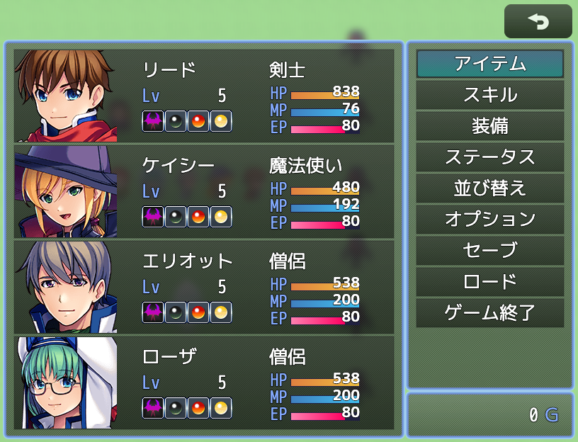
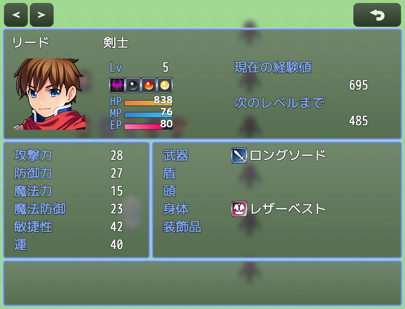
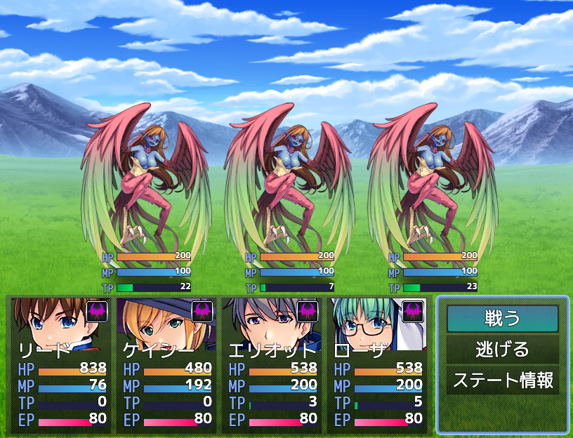
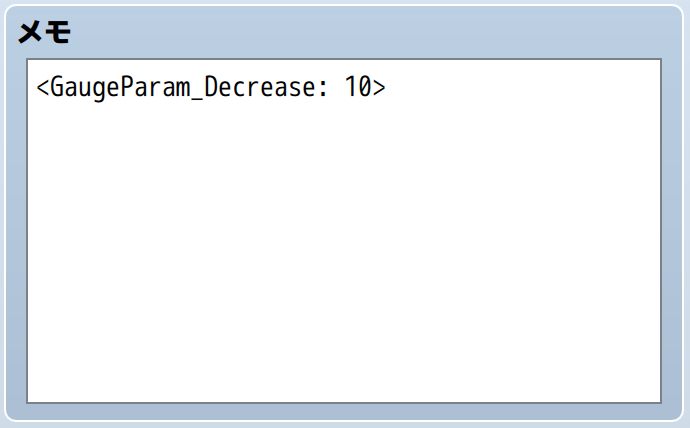

# HTN_GaugeParam

RPGツクールMZ用のプラグインです。

ゲージ付きの独自パラメータをアクター（プレイヤーキャラ）に追加します。  
敵キャラ側には追加されません。  
ゲージはメニュー画面、ステータス画面、戦闘画面に表示されます。

スキルやアイテムのメモ欄にタグを記述することで、使用時にパラメータ値を変化させることや、  
ステートのメモ欄にタグを記述することで、毒やリジェネのように毎ターン値を変化させることが可能です。

パラメータの値が 0 になるときか最大値になるときに、コモンイベントを呼び出すことができます。

| メニュー画面 | ステータス画面 | 戦闘画面 |
|:---:|:---:|:---:|
|  |  |  |

## 🛠️ 導入方法

**[【ここを右クリックして「名前を付けてリンク先を保存」みたいな項目を選んでダウンロード】](https://raw.githubusercontent.com/nekonenene/RPG-Maker-MZ-plugins/main/my_plugins/HTN_GaugeParam/HTN_GaugeParam.js)**

プラグインの導入方法については、[ツクール公式サイトの講座ページ](https://rpgmakerofficial.com/product/mz/plugin/start/dounyu.html)をご参考に！  
ダウンロードした `HTN_xxx.js` のような名前のファイルを、プロジェクト内の `js/plugins` フォルダーの中に入れてください。

## 🧭 使い方

「プラグイン管理」画面でこのプラグインを追加した後、  
プラグインパラメータでいろいろな設定が可能です。

プラグインパラメータの一覧：

| 項目名 | 説明 |
|---|---|
| 最大値 | 独自パラメータの最大値 |
| 初期値 | ゲーム開始時・初期化時の値 |
| 全回復時に初期値にリセット | 宿屋などの全回復の際に、パラメータ値を初期値に戻すか |
| パラメータ名 | 戦闘中の回復メッセージなどで使用される名称 |
| ゲージラベル | ゲージ内に表示する短いラベル |
| 増加メッセージ | 戦闘時に値が増えたときのメッセージ（空欄にすると非表示） |
| 減少メッセージ | 戦闘時に値が減ったときのメッセージ（空欄にすると非表示） |
| 戦闘中の回復音 | 戦闘時に増加・減少のどちらで回復音を鳴らすか |
| ステータス画面に表示 | メニュー画面やステータス画面でゲージを表示するか |
| ステータス画面でTPより優先 | メニュー画面やステータス画面で、TPゲージではなくこのゲージを表示させるか |
| 戦闘画面に表示 | 戦闘画面でゲージを表示するか |
| ゲージ左端カラー・ゲージ右端カラー | ゲージのグラデーション色（HTMLカラーコード） |

## 🧩 機能詳細

スキル・アイテム・ステートの「メモ」欄に特定のタグを記述することで、  
スキルやアイテムの使用時、ステートにかかっているときのターン終了時に、  
パラメータの値を変化させることができます。

### 「メモ」欄に使用できるタグ

スキル・アイテム・ステートの「メモ」欄に以下のどちらかのタグを記述することで、  
パラメータの値を変化させます。（Increase＝増加、Decrease＝減少）

```
<GaugeParam_Increase: 数値か数式>
<GaugeParam_Decrease: 数値か数式>
```

数式内で使用できる変数：

| 変数 | 内容 |
|---|---|
| `a` | 行動の主体（スキル・アイテムの使用者、ステートの持ち主） |
| `b` | 対象 |
| `v` | ゲーム変数（例えば `v[1]` で、変数ID 0001 の値） |

ステートや、自分自身に使うスキル・アイテムでは、 `a` と `b` はどちらも同じキャラとなります。

ダメージ計算式のように、キャラ情報の参照が可能です。（敵キャラは `level` を持ちません）

| 変数名 | 内容 | 変数名 | 内容 |
|---|---|---|---|
| `hp` | HP | `mhp` | 最大HP |
| `mp` | MP | `mmp` | 最大MP |
| `tp` | TP | `level` | レベル |
| `atk` | 攻撃力 | `def` | 防御力 |
| `mat` | 魔法攻撃力 | `mdf` | 魔法防御力 |
| `agi` | 敏捷性 | `luk` | 運 |

記述例：

```
<GaugeParam_Increase: 5>  （5増加）
<GaugeParam_Increase: a.atk * 0.5>  （行動主体の攻撃力の半分だけ増加）
<GaugeParam_Decrease: (a.mat - b.mdf) / 2>  （行動主体の魔法攻撃力と、攻撃対象の魔法防御力の差の半分だけ減少）
<GaugeParam_Decrease: v[1]>  （変数ID 0001 の値のぶん減少）
```



### コモンイベントの発動

値が最大に達した瞬間に「最大値でのコモンイベント」が呼び出され、  
値が0になった瞬間に「最小値でのコモンイベント」が呼び出されます。  
**どちらかだけが設定される**ことを想定しています。

例えば、値が0になったときに特定のステートを付与することや、ゲームオーバーへの遷移に活用できます。  
戦闘中かどうかなどは見ずにすぐ発生するので、  
独自パラメータを変化させるアイテムを用意している場合は、この挙動に注意が必要です。

プラグインパラメータの「発動アクター格納変数」に変数IDを設定すると、  
どのアクターがきっかけとなってコモンイベントが発動したのかがわかるようになります。

### プラグインコマンド

| コマンド | 説明 |
|---|---|
| 値を変化させる | 指定アクターの値を指定量だけ変化させる（正の数で増加、負の数で減少） |
| 値を設定する | 指定アクターの値を指定した値に設定する |
| 値を取得する | 指定アクターの値をゲーム変数に格納する |
| 値を初期値に戻す | 指定アクターの値を初期値に戻す |

「アクターID」の引数はアクターを直接選択できますが、  
「テキスト」タブから `v[1]` のように入力することで、  
ゲーム変数に格納されたIDのアクターを対象にすることもできます。

### 複雑な数式を書くとき（プログラマー向け）

タグ内に `<` や `>` を書きたい場合は、  
それぞれ `&lt;` と `&gt;` に置き換えて記述してください。

三項演算子を書く例：

```
<GaugeParam_Decrease: (a.hp / a.mhp) &gt; 0.5 ? 10 : 5>
```

## 💡 参考情報

### 他プラグインからの利用（プラグイン作成者向け）

作成しているプラグインで、このプラグインの独自パラメータの値を操作したい場合、  
グローバルクラス `HTN_GaugeParam` を通じて値にアクセスできます。

```javascript
HTN_GaugeParam.getValue(actor)           // 値の取得
HTN_GaugeParam.initValue(actor)          // 初期値に戻す
HTN_GaugeParam.setValue(actor, value)    // 値を設定する
HTN_GaugeParam.changeValue(actor, delta) // 値を増加・減少させる
```

プラグインには、このプラグインを先に読み込む必要があることを  
[アノテーション](https://rpgmakerofficial.com/product/mz/plugin/make/annotation.html)を使って記述しておくことをオススメします。

```js
/*:
 * @base HTN_GaugeParam
 * @orderAfter HTN_GaugeParam
 */
```

## 📝 作者情報

ハトネコエ  
**[X : @nekonenene](https://x.com/nekonenene)**  
HP : [https://hato-neko.x0.com](https://hato-neko.x0.com)

バグ報告や要望などは [X](https://x.com/nekonenene) にメンションでお寄せください。

## 📄 ライセンス

MIT License ( https://opensource.org/license/mit )
