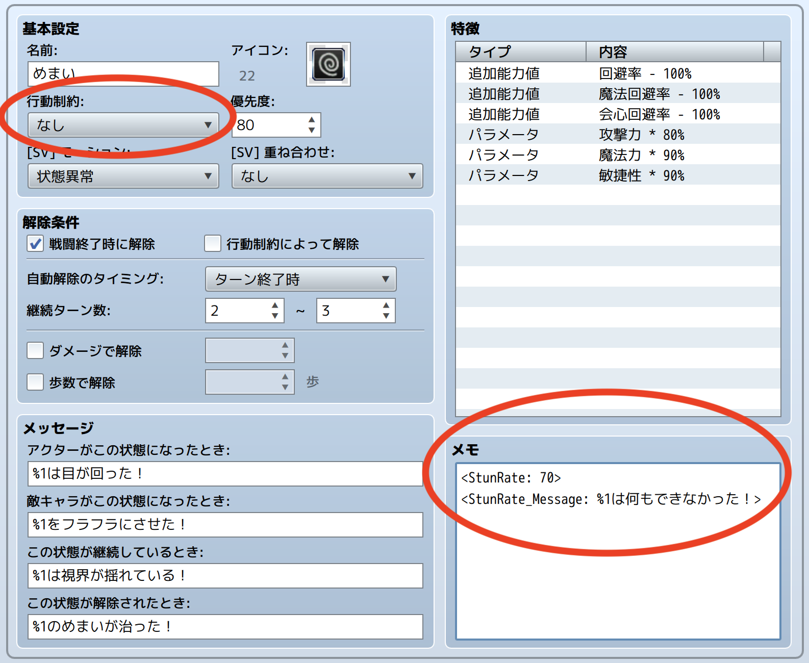

# HTN_StunRate

RPGツクールMZ用のプラグインです。

一定確率で行動できないステート（状態異常）を作成できるようになります。  
[公式プラグイン](https://rpgmakerofficial.com/product/mz/download/dl_plugin.html)の「NumbState.js」では、行動不能時のメッセージをステートごとに個別に設定できなかったため作成しました。

## 🛠️ 導入方法

**[【ここを右クリックして「名前を付けてリンク先を保存」みたいな項目を選んでダウンロード】](https://raw.githubusercontent.com/nekonenene/RPG-Maker-MZ-plugins/main/my_plugins/HTN_StunRate/HTN_StunRate.js)**

プラグインの導入方法については、[ツクール公式サイトの講座ページ](https://rpgmakerofficial.com/product/mz/plugin/start/dounyu.html)をご参考に！  
ダウンロードした `HTN_xxx.js` のような名前のファイルを、プロジェクト内の `js/plugins` フォルダーの中に入れてください。

## 🧭 使い方

「プラグイン管理」画面でこのプラグインを追加した後、  
ステートの「メモ」欄にタグを記入することで、  
そのステートがこのプラグインの効果を持つようになります。

⚠️ **ステートの「行動制約」は「なし」に設定する**よう気を付けてください。  
通常の麻痺のように「行動できない」だと、常に行動できず、このプラグインは機能しません。

```
<StunRate>
```

単純に `<StunRate>` と書く場合、プラグインパラメータの「行動不能の確率(%)」の値が使用されますが、  
以下の例のように、行動不能の確率をいっしょに指定することも可能です。

```
<StunRate: 60>
```

この場合、このステートにかかっていると60%の確率で行動不能になります。  
（プラグインパラメータの設定は無視されます）

設定例：



プラグインパラメータでは「防御を常に許可」「アイテム使用を常に許可」などのオプションも設定可能です。  
「魔法スキルを常に許可」以外の「〇〇を常に許可」をすべて true に変更することで、魔法だけたまに失敗するステートの作成も可能です。

## 🧩 機能詳細

プラグインパラメータの設定値がデフォルトとなりますが、  
ステートの「メモ」欄にタグを記入することで、個別に設定することも可能です。  
必要に応じて設定してください。

### タグ一覧

ステートの「メモ」欄に記述できるタグの一覧です。

`<StunRate>` （または `<StunRate: 確率>` ）以外のタグは、  
プラグインパラメータの設定を上書きしない場合には記述しなくて大丈夫です。

- `<StunRate: 確率>`  
  このプラグインを有効化するために必要なタグ。値は行動不能になる確率(%)を指定。省略するとプラグインパラメータのデフォルト値を使用
- `<StunRate_Message: テキスト>`  
  行動不能になったときの表示メッセージを上書き（文字列内の `%1` は行動者名に置換されます）
- `<StunRate_ShowStateMessageBeforeAction: true/false>`  
  ステートの継続メッセージを、行動の前に表示するかの設定を上書き
- `<StunRate_AllowAttack: true/false>`  
  true の場合、通常攻撃はスタンせず必ず行動可能
- `<StunRate_AllowGuard: true/false>`  
  true の場合、防御はスタンせず必ず行動可能
- `<StunRate_AllowItem: true/false>`  
  true の場合、アイテム使用はスタンせず必ず行動可能
- `<StunRate_AllowMagicSkill: true/false>`  
  true の場合、魔法スキル（スキルタイプ１番）はスタンせず必ず行動可能
- `<StunRate_AllowSpecialSkill: true/false>`  
  true の場合、必殺技スキル（スキルタイプ２番）はスタンせず必ず行動可能

#### コピーしやすい用の一覧

```
<StunRate: 25>
<StunRate_Message: %1は動けない！>
<StunRate_ShowStateMessageBeforeAction: true>
<StunRate_AllowAttack: false>
<StunRate_AllowGuard: false>
<StunRate_AllowItem: false>
<StunRate_AllowMagicSkill: false>
<StunRate_AllowSpecialSkill: false>
```

### 「魔法スキルを許可」「必殺技スキルを許可」オプションについて

「魔法スキルを許可 (AllowMagicSkill)」は、スキルタイプのIDが 1 であるかで判定しています。  
「必殺技スキルを許可 (AllowSpecialSkill)」は、スキルタイプのIDが 2 であるかで判定しています。

データベースの「タイプ」で、「スキルタイプ」の「01」や「02」を別の用途に変更している場合には、  
このオプションは想定と異なる挙動をします。ご注意ください。

### 行動不能時のメッセージの補足

`<StunRate>` タグを持つステートが複数存在し、それらに同時にかかっている場合、  
各ステートで「優先度」の順にスタン判定がおこなわれ、  
最初にスタン判定となったステートのメッセージが表示されます。

### 継続メッセージの表示タイミングについて

RPGツクールMZの仕様では、ステートの継続メッセージに関して、  
継続メッセージが設定されているステートのうち、「優先度」がもっとも高い１つのみが表示されます。  
（参考: `Game_BattlerBase.prototype.mostImportantStateText` ）

そのため、プラグインパラメータの「行動前に継続メッセージを表示」を false に設定することや  
メモ欄に `<StunRate_ShowStateMessageBeforeAction: false>` と記述することをおこなっても、  
必ずしも継続メッセージが行動後に表示されるわけではないことにご注意ください。

### NumbState.js とのマニアックな違い

[公式プラグイン](https://rpgmakerofficial.com/product/mz/download/dl_plugin.html)である「NumbState.js」との微妙な挙動の違いとして、  
NumbState.js では、 processTurn 内で clearActions を呼び出すため、スタン時は全行動をキャンセルしていましたが、  
このプラグインでは startAction 内でアクションごとにキャンセル処理をおこないます。

そのため、アクターや職業などの特徴で「行動回数追加」を設定していて、１ターンに複数回の行動がおこなわれる場合、  
このプラグインでは、複数回の行動それぞれでスタン判定がおこなわれることになります。

## 📝 作者情報

ハトネコエ  
**[X : @nekonenene](https://x.com/nekonenene)**  
HP : [https://hato-neko.x0.com](https://hato-neko.x0.com)

バグ報告や要望などは [X](https://x.com/nekonenene) にメンションでお寄せください。

## 📄 ライセンス

MIT License ( https://opensource.org/license/mit )
